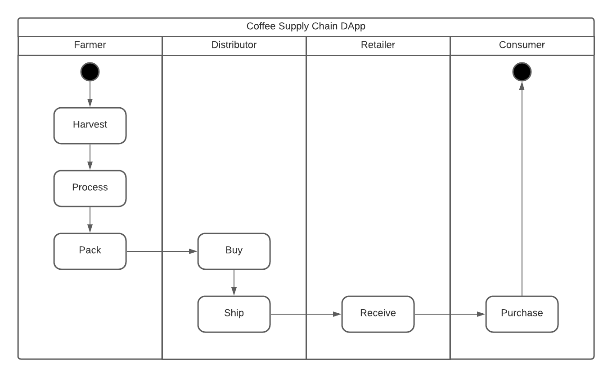
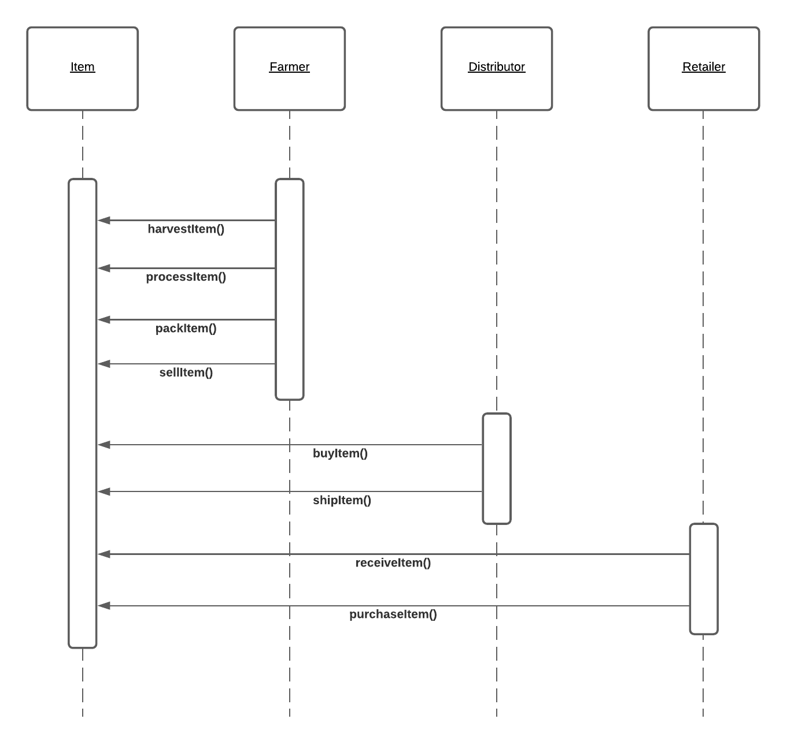
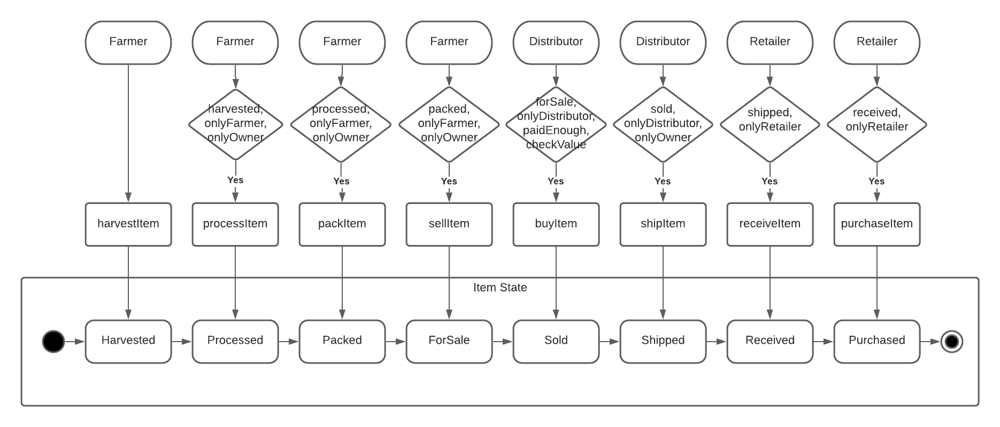
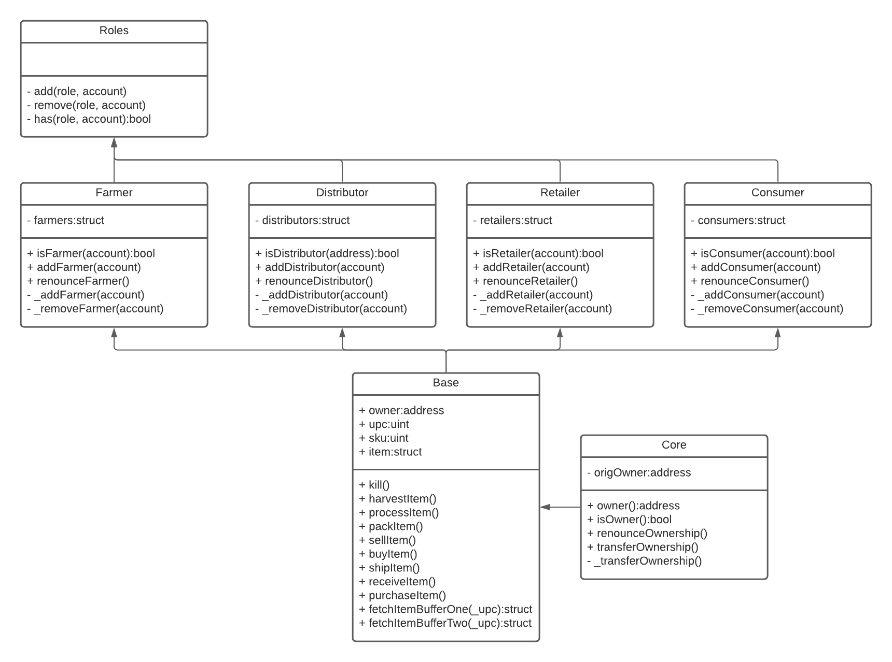

# Coffee producing supply chain tracking decentralized app

Ethereum DApp that demonstrates a Supply Chain flow between Farmer, Distributor, Retailer and Consumer. A Farmer can add harvested coffee beans package to the inventory system stored in the blockchain. A Distributor can purchase such items from the inventory system. Additionally a Distributor can mark an item as Shipped, and similarly a Consumer can mark an item as Received and Purchased.

## Activity Diagram
A coffee package lifecycle consists of 7 states and starts with the Harvested state.

## Sequence Diagram
The system contains four roles, three of those are managing coffee package item state (Farmer, Distributor, Retailer). Consumer can request information about the coffee package from the blockchain.

## State Diagram
Access control is implemented with a set of modifiers preventing state transition by a wrong role or when the supply is not paid in full.

## Class Diagram
Role management logic and controls implemented in the Roles class and a set of inherited role classes: Farmer, Distributor, Retailer, Consumer. The coffee package item data model and state management logic is implemented in the Base class inherited from role classes and Core class.


# Getting Started

These instructions will get you a copy of the project up and running on your local machine for development and testing purposes. See deployment for notes on how to deploy the project on a live system.

## Prerequisites

Please make sure you've already installed ganache-cli, Truffle and enabled MetaMask extension in your browser.

### Truffle v4.1.14
```
# Unsinstall any previous version
npm uninstall -g truffle
# Install
npm install -g truffle
# Specify a particular version
npm install -g truffle@4.1.14
# Verify the version
truffle version
```

### Metamask v10.x.x
If you need to update Metamask just delete your Metamask extension and install it again.

### Ganache
```
# Install Ganache command line interface
npm install -g ganache-cli
```
Make sure that your Ganache and Truffle configuration file have the same port.


## Running the application
Install dependencies
```
cd project-6
# install all modules listed as dependencies in package.json
npm install
```
Launch Ganache:
```
ganache-cli -m "spirit supply whale amount human item harsh scare congress discover talent hamster"
```

Your terminal should look something like this:


In a separate terminal window, Compile smart contracts:
```
truffle compile
```

Your terminal should look something like this:


This will create the smart contract artifacts in folder ```build\contracts```.

Migrate smart contracts to the locally running blockchain, ganache-cli:

```
truffle migrate
```
Your terminal should look something like this:


Test smart contracts:
```
truffle test
```

All 10 tests should pass.


In a separate terminal window, launch the DApp:
```
npm run dev
```

## Test network contract
The contract deployed to test Rinkeby network:
https://rinkeby.etherscan.io/address/0x175a8f8604dcde1f139d8ec633491b6646f90c9a#code

## Built With

* [Ethereum](https://www.ethereum.org/) - Ethereum is a decentralized platform that runs smart contracts
* [Truffle Framework](http://truffleframework.com/) - Truffle is the most popular development framework for Ethereum with a mission to make your life a whole lot easier.